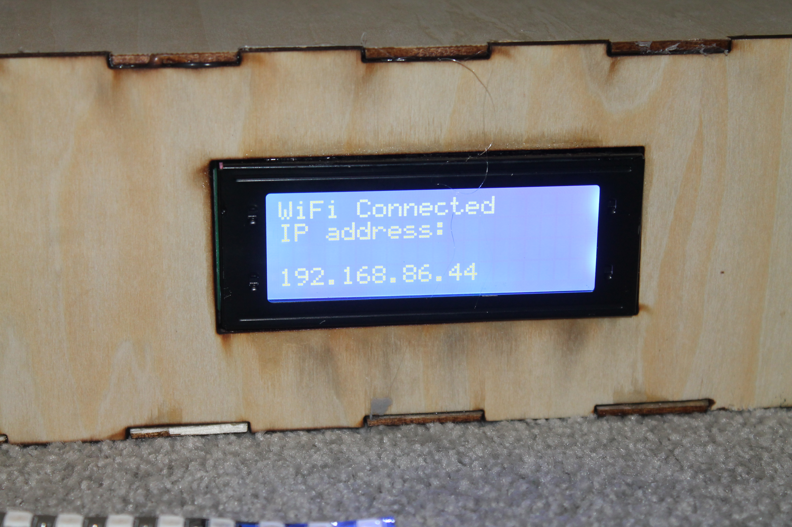
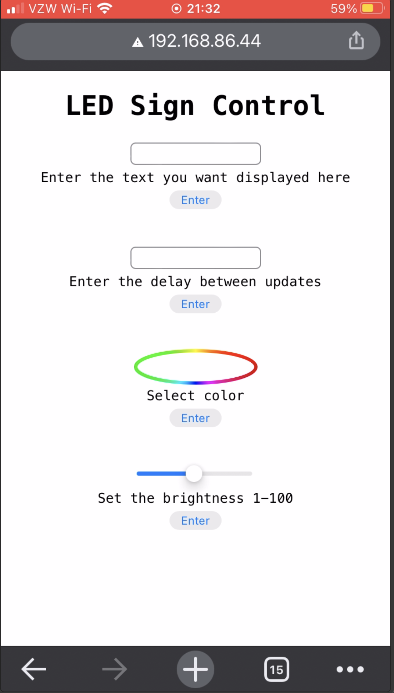

# WiFi Controlled LED Sign
An LED sign that is controlled over WifI


Complete with a status LCD screen and control over a simple website




# Demonstration 
https://youtu.be/xXT149byX28

# Materials
 - ESP32
 - 32x8 
 - 5v Power Supply
 - I<sup>2</sup>C LCD Screen
 - 10uf capacitor  
 - Breadboards

# How to build
1. Open the LED_Board.ino file in the [Arduino IDE](https://www.arduino.cc/en/software)
   
2. Install the required libraries:
   - ESP32 WiFi 
   - Adafruit_GFX
   - Adafruit_NeoMatrix
   - Adafruit_NeoPixel
   - LiquidCrystal_I2C
   - Wire
3. Update the variables in LED_Board.ino
```<c++>
const char *ssid = "Wifi Name";
const char *password = "Password";
#define DATA_PIN 4
#define LED_PIN 5
#define MATRIX_WIDTH 32
#define MATRIX_HEIGHT 8
#define HOSTNAME "LED-Sign"
#define PORT 80
```
I reccomend leaving the port the default because you won't have to type a port at the end ofthe url. The LED pin refers to the pin of a status led and the data pin refers to the pin that connects to the matrix. 

<br>

4. Wire up the ESP32

List of connections:
    - Connect the EN pin to ground through a 10uf capacitor (not necessary but helps if you're having trouble uploading code)
    - Connect an LED to ground through a 220 ohm resister on the pin defined in your code
    - Connect the SDA and SCL pins on your LCD screen to the SDA and SCL pins on the ESP32
    - Connect ground and 5v to the LED matrix, LCD and ESP32 (for the ESP32 I had to connect 5v through the usb instead of the pins. I'm unsure if this is the case for all models though.)
    - Connect data to the LED matrix on the pin define in the previous section
    - Connect up power to the power supply and connect the power supply to the breadboards
  
<br>
5. To make the box laser cut out all the svg files in the SVG folder. The file titled "Electronics Box.svg" contains all the parts in one file, while the other files split it up. After laser cutting slide the power carts, assemble all but one side. Put all the electronics in the box and attach the final side. I recommend doing this in a non-permanent way to avoid having the break the box to fix an issue. You can also glue the LED matrix to the backplate if you want it to be more rigid.
   


1. Finally put the lid on and you're done!


   

# For Changing the HTMl
To update the web page design simply write out everything you want in the HTML file (make sure it is only the 1 file, not using external css or images). Then convert the html into 1 line (I did mine [here](https://www.textfixer.com/html/compress-html-compression.php)) then replace all the " with '. Then replace the HTML line in the LED_Board.ino file.